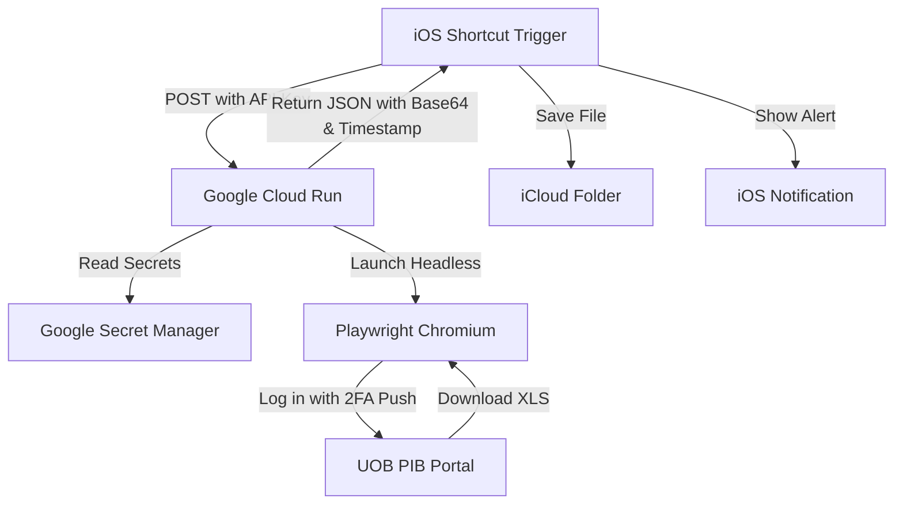

# UOB Credit Card Statement Automation Scraper

An automated scraper built with Node.js and Playwright that logs into UOB Personal Internet Banking (Singapore), prompts you for a 2FA Push Notification approval on your phone, downloads the latest Excel statement, parses it, and exports it.

This scraper is designed to be deployed as a serverless container on **Google Cloud Run** and triggered automatically via **iOS Shortcuts** on your iPhone.

---

## Architecture Overview



---

## 🛠️ Local Development & Setup

### Prerequisites
- Node.js (v18+)
- Google Cloud SDK (`gcloud` CLI) configured on your computer
  - Install via Homebrew:
    ```bash
    brew install --cask google-cloud-sdk
    ```
  - Initialize and log in:
    ```bash
    gcloud init
    ```

### Installation
1. Clone this repository.
2. Install the npm dependencies:
   ```bash
   npm install
   ```
3. Install the Playwright Chromium browser binary:
   ```bash
   npx playwright install chromium
   ```

### Local Configuration
Create a `.env` file in the root of the project:
```env
PORT=8080
UOB_USERNAME=your_username_here
UOB_PASSWORD=your_password_here
TRIGGER_SECRET=your_api_key_here
```

To run the server locally:
```bash
npm start
```
You can trigger the scraper locally with curl:
```bash
curl -X POST http://localhost:8080/trigger-uob \
  -H "x-api-key: your_api_key_here" \
  -H "Content-Type: application/json"
```

---

## ☁️ Google Cloud Deployment (GCP Cloud Run)

To deploy safely, we use **Google Secret Manager** to encrypt your credentials and bypass storing passwords in plain text or build configurations.

### 1. Enable Secret Manager
Enable the API in your Google Cloud Project:
```bash
gcloud services enable secretmanager.googleapis.com
```

### 2. Create the Secrets
Store your credentials securely. Run these commands in your shell:
```bash
# 1. Create the UOB username secret
echo -n "YOUR_UOB_USERNAME" | gcloud secrets create uob_username --data-file=-

# 2. Create the UOB password secret
echo -n "YOUR_UOB_PASSWORD" | gcloud secrets create uob_password --data-file=-

# 3. Create the API trigger key
echo -n "YOUR_SECURE_TRIGGER_KEY" | gcloud secrets create trigger_secret --data-file=-
```

### 3. Grant Secret Access to the Cloud Run Service Account
Your Cloud Run service runs under a default service account. You must grant it permission to read these secrets.
Replace `397901354778` with your Google Cloud Project Number:

```bash
# Grant access to UOB username
gcloud secrets add-iam-policy-binding uob_username \
    --member="serviceAccount:397901354778-compute@developer.gserviceaccount.com" \
    --role="roles/secretmanager.secretAccessor"

# Grant access to UOB password
gcloud secrets add-iam-policy-binding uob_password \
    --member="serviceAccount:397901354778-compute@developer.gserviceaccount.com" \
    --role="roles/secretmanager.secretAccessor"

# Grant access to the Trigger API key
gcloud secrets add-iam-policy-binding trigger_secret \
    --member="serviceAccount:397901354778-compute@developer.gserviceaccount.com" \
    --role="roles/secretmanager.secretAccessor"
```

### 4. Deploy the Container to Cloud Run
Deploy using the `--set-secrets` flag to securely map your Secret Manager keys into the container environment variables:

```bash
gcloud run deploy uob-scraper --source . \
  --region asia-southeast1 \
  --memory 2Gi \
  --cpu 1 \
  --timeout 120s \
  --set-secrets UOB_USERNAME=uob_username:latest,UOB_PASSWORD=uob_password:latest,TRIGGER_SECRET=trigger_secret:latest \
  --allow-unauthenticated
```
*(If you ever need to reset or overwrite plain text environment variables set in earlier revisions, add `--remove-env-vars UOB_USERNAME,UOB_PASSWORD,TRIGGER_SECRET` to the command above).*

---

## 📱 iOS Shortcuts Integration

Once the API is live, you can configure your iPhone to download and save the statement with a single tap.

### Shortcut Steps Breakdown:
1. **Get contents of URL**:
   - URL: `https://YOUR_CLOUD_RUN_URL/trigger-uob`
   - Method: `POST`
   - Headers:
     - `x-api-key`: `YOUR_SECURE_TRIGGER_KEY`
     - `Content-Type`: `application/json`
2. **Get Dictionary from Input** (from the URL contents)
3. **Get Value for Key `fileData` in Dictionary**
4. **Base64 Encode/Decode**: Set to **Decode** on the `fileData` output
5. **Set Name**: Rename the decoded file output to `UOB_Statement.xls` (or any custom name)
6. **Save File**: Save the renamed file to your iCloud folder (e.g. `Shortcuts/Statements/`) with **Overwrite** turned on
7. **Get Value for Key `statementTimestamp` in Dictionary**:
   - *Tip: Use **Select Magic Variable** to link this back to the output of step 2.*
8. **Show Notification**:
   - Text: `UOB Statement [Timestamp]`

---

## ⚠️ Security Notes & Best Practices
- **Never commit credentials** directly into your repository or push them to GitHub. Always use `.gitignore` to exclude `.env` files.
- The scraper runs in a transient Docker container on Cloud Run. No session cookies, browser data, or downloaded spreadsheets are persisted on Google Cloud once the run completes.
- Keep the `TRIGGER_SECRET` long and random to prevent unauthorized scraping attempts.