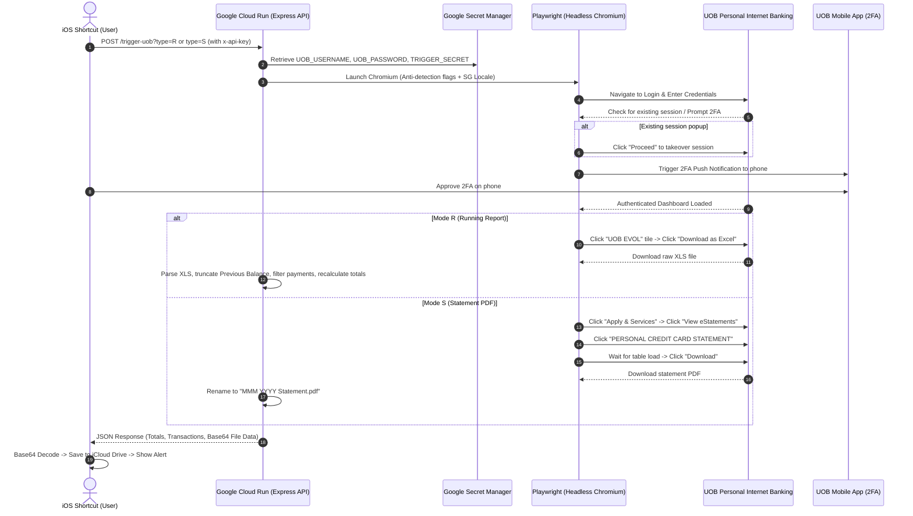

# 💳 UOB Automation Scraper (Credit Card Statement & Running Report)

An automated serverless automation system built with **Node.js**, **Playwright**, and **Google Cloud Run** that connects to **UOB Personal Internet Banking (Singapore)**. It handles login, awaits your mobile phone 2FA push approval, and automatically fetches either your latest **official e-Statement PDF** or your unbilled **Running Report Excel (XLS)** with intelligent transaction cleansing and metadata extraction.

The system is designed to be triggered on-demand or on a schedule via **iOS Shortcuts** on iPhone, iPad, or Mac, seamlessly saving files to iCloud Drive and surfacing expense metrics.

---

## 📑 Table of Contents
1. [Architecture Overview](#-architecture-overview)
2. [Operational Modes](#-operational-modes)
   - [Mode R: Running Report (Excel)](#mode-r-running-report-excel)
   - [Mode S: Official Statement (PDF)](#mode-s-official-statement-pdf)
3. [Key Technical Highlights & Resilience](#-key-technical-highlights--resilience)
4. [API Specification](#-api-specification)
   - [Running Report Response (`type=R`)](#1-running-report-response-typer)
   - [Statement PDF Response (`type=S`)](#2-statement-pdf-response-types)
5. [iOS Shortcuts Integration Guide](#-ios-shortcuts-integration-guide)
6. [Google Cloud Run Deployment](#-google-cloud-run-deployment)
7. [Local Development & Debugging](#-local-development--debugging)
8. [Security & Privacy Guarantees](#-security--privacy-guarantees)

---

## 🏛 Architecture Overview



---

## 🔀 Operational Modes

The service supports two dedicated modes passed via query parameter (`?type=...`) or JSON request body (`{ "type": "..." }`):

### Mode R: Running Report (Excel)
- **Parameter**: `type=R` (default if omitted)
- **Execution Time**: ~25–30 seconds
- **What it does**:
  1. Navigates to the authenticated accounts dashboard.
  2. Clicks the **UOB EVOL** card tile.
  3. Clicks **Download as Excel** (`button:has-text("Download as Excel")`).
  4. Downloads the raw bank XLS file (`CC_TXN_History_<timestamp>.xls`).
  5. **Cleansing Pipeline**:
     - Strips bank header metadata (detects transaction headers at row 9).
     - Identifies the `Previous Balance` row and **truncates all older statement transactions**, leaving only entries from the active, unbilled cycle.
     - Strips payment and settlement rows (e.g. `PAYMT THRU E-BANK...`).
     - Standardizes transaction descriptions and categorizes negative amounts as `Cashback` or `Refund`.
     - Dynamically rewrites cell `B6` in the Excel spreadsheet to reflect the current cycle month (e.g., `Sep 2026`).
     - Calculates `totalAmount` (net balance), `totalExpenses`, and `totalRefunds`.
     - Returns clean transaction objects and base64-encoded clean XLS.

### Mode S: Official Statement (PDF)
- **Parameter**: `type=S`
- **Execution Time**: ~25–30 seconds
- **What it does**:
  1. Navigates to the authenticated accounts dashboard.
  2. Clicks the **Apply & Services** navigation tab (`/servicesHome`).
  3. Clicks the **View eStatements** tile (`/estatements`).
  4. Clicks the **PERSONAL CREDIT CARD STATEMENT** button (`/estatements/view`).
  5. Awaits asynchronous table rendering and verifies the download button is enabled (`button:has-text("Download"):not([disabled])`).
  6. Initiates download and intercepts the generated PDF blob stream.
  7. Formats the output filename to clean calendar syntax: **`MMM YYYY Statement.pdf`** (e.g., `Aug 2026 Statement.pdf`).
  8. Returns base64-encoded PDF and file metadata.

---

## 🛡️ Key Technical Highlights & Resilience

1. **Anti-Bot & Stealth Configuration**:
   - Custom User-Agent matching modern macOS Chrome.
   - Masked `navigator.webdriver` property and initialised `window.chrome` runtime mocks.
   - Headless arguments: `--disable-blink-features=AutomationControlled`, `--no-sandbox`, and Singapore locale/timezone presets.
2. **Stale Active Session Handshake**:
   - Detects UOB's `"Existing session detected"` takeover modal and automatically clicks `Proceed` without stalling.
3. **SPA React Hydration Awareness**:
   - UOB Personal Internet Banking is a Single Page Application (SPA). The scraper includes hydration checkpoints ensuring React event listeners are bound before clicking navigation items.
4. **Button Disabled-State Detection**:
   - On the eStatements viewer, the download button is visible in the DOM before statement rows are fetched, but is initially marked `disabled`. The scraper explicitly waits for `:not([disabled])` and avoids force-clicking to prevent silent click drops.
5. **Zero Persistent Storage Footprint**:
   - All downloaded files are processed in-memory / temporary scratch paths and explicitly deleted in a `finally` block via `fs.unlinkSync`, leaving zero data on Cloud Run.

---

## 📡 API Specification

### Endpoint
- **URL**: `https://<YOUR_CLOUD_RUN_URL>/trigger-uob`
- **Method**: `POST` (or `GET`)
- **Headers**:
  - `x-api-key`: `<TRIGGER_SECRET>`
  - `Content-Type`: `application/json`
- **Query / Body Parameter**:
  - `type`: `'R'` or `'S'` (case-insensitive)

---

### 1. Running Report Response (`type=R`)

```json
{
  "success": true,
  "mode": "R",
  "type": "R",
  "cardName": "UOB EVOL CARD",
  "card": "UOB EVOL CARD",
  "count": 59,
  "totalAmount": 991.55,
  "total": 991.55,
  "totalAmountFormatted": "991.55",
  "totalExpenses": 1041.55,
  "totalRefunds": 50.00,
  "transactions": [
    {
      "date": "2026-09-18T00:00:00.000Z",
      "description": "FAIRPRICE FINEST",
      "currency": "SGD",
      "amount": 34.20,
      "badge": null
    },
    {
      "date": "2026-09-15T00:00:00.000Z",
      "description": "Cashback",
      "currency": "SGD",
      "amount": -50.00,
      "badge": "Cashback"
    }
  ],
  "fileName": "CC_TXN_History_1790089082023.xls",
  "fileData": "<BASE64_EXCEL_DATA>",
  "fileSize": 28672,
  "reportFileName": "CC_TXN_History_1790089082023.xls",
  "reportFileData": "<BASE64_EXCEL_DATA>",
  "statementTimestamp": "22:58:02 Sep 22, 2026"
}
```

---

### 2. Statement PDF Response (`type=S`)

```json
{
  "success": true,
  "mode": "S",
  "type": "S",
  "fileName": "Aug 2026 Statement.pdf",
  "fileData": "<BASE64_PDF_DATA>",
  "fileSize": 174990,
  "mimeType": "application/pdf",
  "statementFileName": "Aug 2026 Statement.pdf",
  "statementFileData": "<BASE64_PDF_DATA>",
  "statementTimestamp": "23:05:12 Sep 22, 2026"
}
```

---

## 📱 iOS Shortcuts Integration Guide

### Shortcut 1: Sync Running Report (Excel)
1. **Get contents of URL**:
   - URL: `https://<YOUR_CLOUD_RUN_URL>/trigger-uob?type=R`
   - Method: `POST`
   - Headers: `x-api-key` = `YOUR_TRIGGER_SECRET`
2. **Get Dictionary from Input**: Pass URL response.
3. **Get Value for Key**:
   - `totalAmountFormatted` $\rightarrow$ Spend to date.
   - `count` $\rightarrow$ Total transactions.
   - `fileData` $\rightarrow$ Base64 file contents.
   - `fileName` $\rightarrow$ File name for export.
4. **Base64 Encode**: Set Mode to **Decode** on `fileData`.
5. **Set Name**: Set name of decoded file to `fileName`.
6. **Save File**: Save to `iCloud Drive/Financials/UOB/Reports/`.

---

### Shortcut 2: Download Monthly Statement (PDF)
1. **Get contents of URL**:
   - URL: `https://<YOUR_CLOUD_RUN_URL>/trigger-uob?type=S`
   - Method: `POST`
   - Headers: `x-api-key` = `YOUR_TRIGGER_SECRET`
2. **Get Dictionary from Input**: Pass URL response.
3. **Get Value for Key**:
   - `fileName` $\rightarrow$ e.g., `"Aug 2026 Statement.pdf"`.
   - `fileData` $\rightarrow$ Base64 file contents.
4. **Base64 Encode**: Set Mode to **Decode** on `fileData`.
5. **Set Name**: Set name of decoded file to `fileName`.
6. **Save File**: Save to `iCloud Drive/Financials/UOB/Statements/`.
7. **Show Notification**:
   - Title: `UOB Statement Saved`
   - Body: `Downloaded [fileName] successfully.`

---

## ☁️ Google Cloud Run Deployment

All sensitive credentials (`UOB_USERNAME`, `UOB_PASSWORD`, `TRIGGER_SECRET`) are stored in **Google Secret Manager** and mapped into Cloud Run environment variables at runtime.

### 1. Store Secrets in Secret Manager
```bash
echo -n "YOUR_UOB_USERNAME" | gcloud secrets create uob_username --data-file=-
echo -n "YOUR_UOB_PASSWORD" | gcloud secrets create uob_password --data-file=-
echo -n "YOUR_SECURE_TRIGGER_KEY" | gcloud secrets create trigger_secret --data-file=-
```

### 2. Grant Secret Access to Cloud Run
Replace `PROJECT_NUMBER` with your Google Cloud project number:
```bash
for secret in uob_username uob_password trigger_secret; do
  gcloud secrets add-iam-policy-binding $secret \
    --member="serviceAccount:PROJECT_NUMBER-compute@developer.gserviceaccount.com" \
    --role="roles/secretmanager.secretAccessor"
done
```

### 3. Deploy to Cloud Run
```bash
gcloud run deploy uob-scraper \
  --source . \
  --region asia-southeast1 \
  --memory 2Gi \
  --cpu 1 \
  --timeout 180s \
  --set-secrets UOB_USERNAME=uob_username:latest,UOB_PASSWORD=uob_password:latest,TRIGGER_SECRET=trigger_secret:latest \
  --allow-unauthenticated
```

### 4. Real-time Live Log Streaming
To monitor runs live in your terminal:
```bash
gcloud beta run services logs tail uob-scraper --region asia-southeast1
```

---

## 💻 Local Development & Debugging

### Setup
1. Clone repository and install packages:
   ```bash
   npm install
   npx playwright install chromium
   ```
2. Create local `.env`:
   ```env
   PORT=8080
   UOB_USERNAME=your_username
   UOB_PASSWORD=your_password
   TRIGGER_SECRET=your_api_key
   HEADLESS=true
   ```
3. Start the local server:
   ```bash
   npm start
   ```

### Test Scripts
- **Run local visible browser test for statements**:
  ```bash
  node test-statement.js
  ```
- **Trigger local API via cURL**:
  ```bash
  # Test Running Report
  curl -X POST "http://localhost:8080/trigger-uob?type=R" -H "x-api-key: your_api_key"

  # Test Statement PDF
  curl -X POST "http://localhost:8080/trigger-uob?type=S" -H "x-api-key: your_api_key"
  ```

---

## 🔒 Security & Privacy Guarantees

- **No Hardcoded Secrets**: The repository contains zero credentials. All authentication details are injected dynamically via Google Secret Manager in production and `.env` locally (both `.env` and `.env.local` are `.gitignore`d).
- **Transient Sandboxing**: Each trigger spins up an isolated sandbox. Playwright runs with a fresh, temporary profile that is completely destroyed on container termination.
- **Fail-Safe Authorization**: If `TRIGGER_SECRET` is unset, the server rejects 100% of incoming requests with `500 Server Misconfiguration` to prevent unauthorized execution.